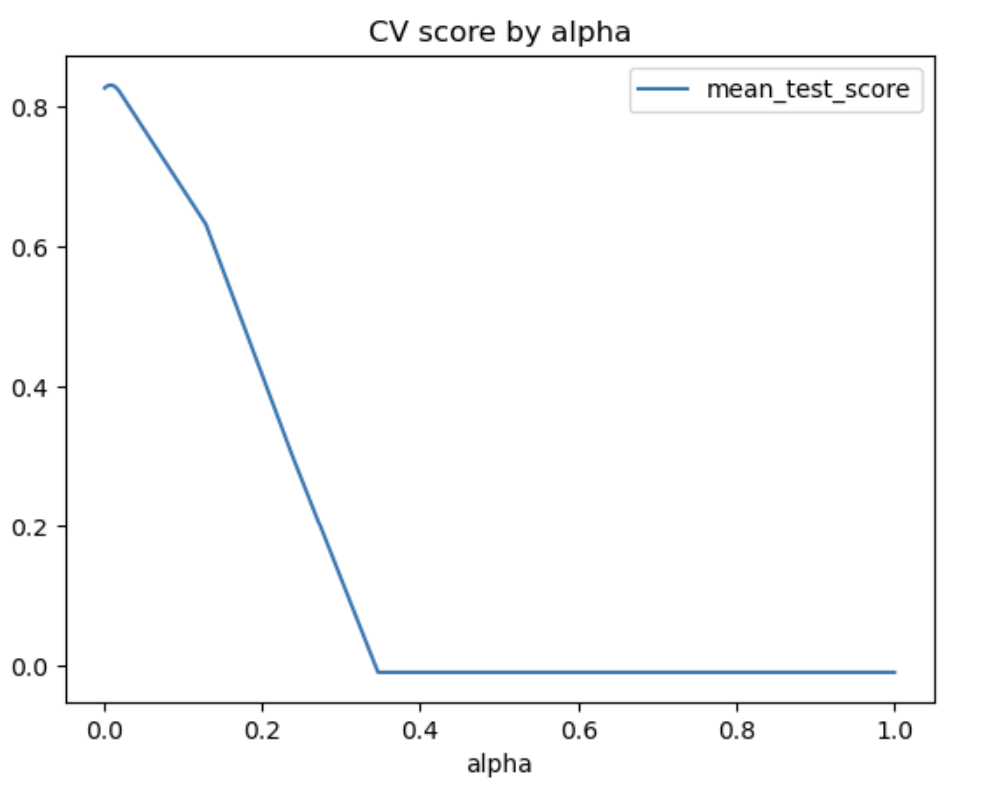
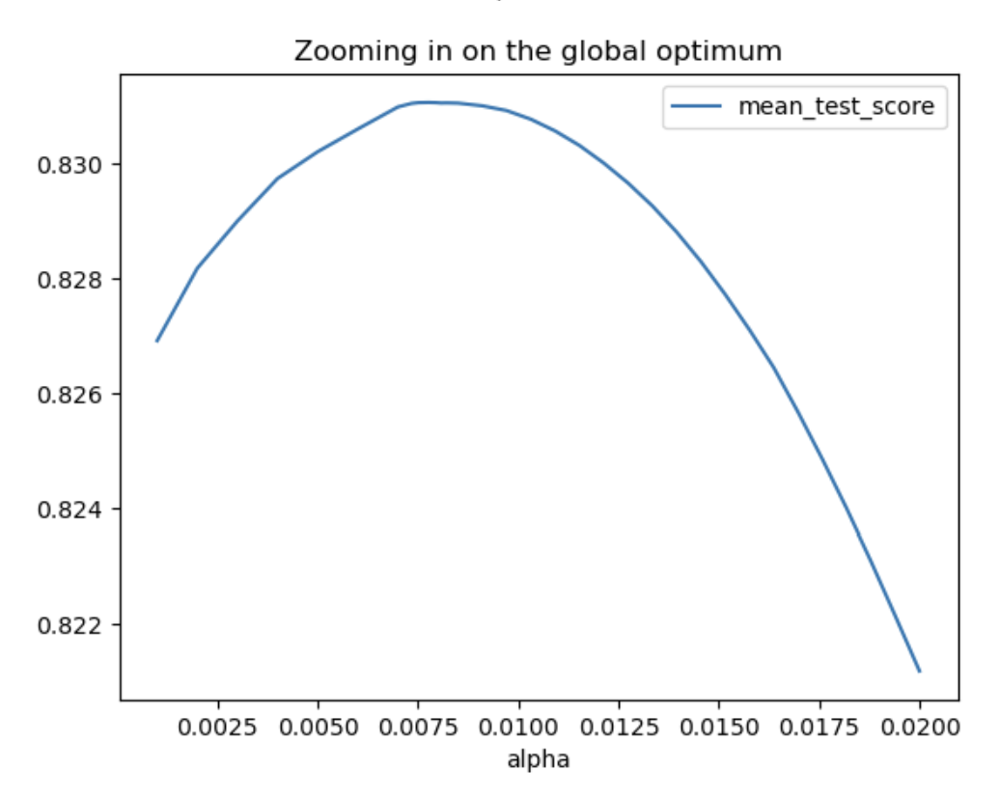

# Machine Learning Practice

### Purpose of this Repository
This repository focuses on predicting housing prices using advanced regression techniques. It includes data preprocessing, exploratory data analysis, feature engineering, feature selection, and model training and evaluation. The main goal is to build an accurate and robust model for predicting housing prices based on various features.

### Key Inputs
The main data source is the housing dataset, which consists of information about various features of residential homes and their sale prices. The dataset is in CSV file format and is included in the repository.

### Package
- pip install `pandas`
- pip install `numpy`
- pip install `scikit-learn`
- pip install `matplotlib`
- pip install `seaborn`

### Output
```python
# Q2 A & B
### APPROACH 1: pipe(preproc+Lasso) into gridsearchcv

# Set up alphas to search (change manually to improve after each run)
# I'm doing a lot where I think the optimal is, plus some to the left
# and right to make sure I'm at a global optimum, not a local optimum

search_alphas = list(np.linspace(0.001,0.007,7))+\
                list(np.linspace(0.0072,0.0082,101))+\
                list(np.linspace(0.0085,.02,20))+\
                list(np.linspace(0.02,1,10))
parameters = [ {'lasso__alpha': search_alphas}]

# set up search grid

grid_search = GridSearchCV(estimator = lasso_pipe, 
                           param_grid = parameters,
                           scoring = 'r2',
                           cv = KFold(10))

results = grid_search.fit(X_train,y_train)

# we now print out the results

df = pd.DataFrame(results.cv_results_).set_index('params')
df['alpha'] = [c['lasso__alpha'] for c in df.index]
df[['rank_test_score','mean_test_score','alpha']]
df = df.sort_values('rank_test_score')
print(f'''The best test score is {df.iloc[0,-4].round(5)} at alpha={df.iloc[0,-1].round(5)}''')

# showing that the chosen alpha is the best twst score for ALL 
# possible alphas - ie, it is a global (not local) maximum

df = df.sort_values('alpha')
df.plot(x='alpha',y='mean_test_score',kind='line',
       title='CV score by alpha')
plt.show()
df.query('alpha<0.05')\
    .plot(x='alpha',y='mean_test_score',kind='line',
       title='Zooming in on the global optimum')
plt.show()
```


