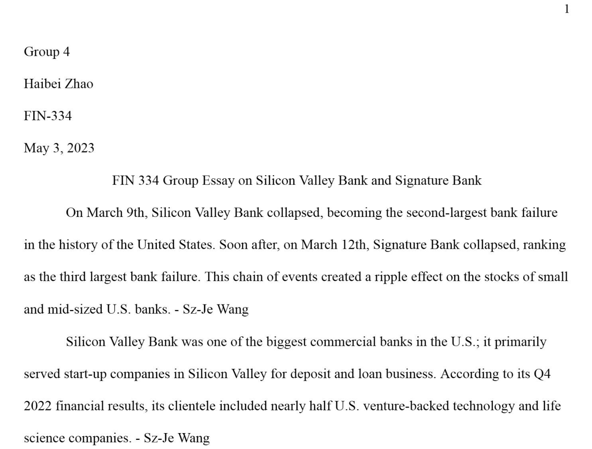
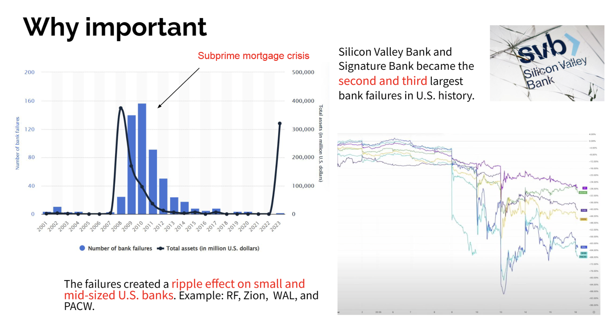

## Table of contents
1. [About Me](#me)
2. [Portfolio](#portfolio)
    - [Natural language processing on Fed announcements](#fed)
    - [Natural language processing 10-Ks to identify risks](#10k)
    - [Discounted cash flow model](#dcf)
    - [Portfolio Optimization Model](#pom)
    - [Regression Practice](#reg)
    - [The collapse of Silicon Valley Bank and Signature bank](#svb)
3. [Job Description and Career Objective](#career)
4. [Hobbies](#hobbies)

---
## About Me  <a name="me"></a>

Hello! My name is Sz-Je Wang, and I am a dedicated and enthusiastic student pursuing a Bachelor of Science in Business and Economics with a Finance major, Business Analytics (BUAN) major, and FinTech minor at Lehigh University. I am passionate about finance and technology, and I am excited to apply my skills and knowledge to make a positive impact in the industry.

<!-- Upload your own photo and change the path -->

<p style="text-align:center;">
  
</p>

---
## Portfolio <a name="portfolio"></a>

_**[Natural language processing on Fed announcements](https://sikaiwang224.github.io/teamproject-/)**_ <a name="fed"></a>

How do Federal Reserve announcements influence the stock market according to Natural language processing, particularly the ETFs across various sectors?


### Specific research question:
- What is the overall sentiment and intensity in the each announcements?
- How do these sentiment scores correlate with subsequent stock market movements for the sector ETFs?
- Can we predict stock market reactions based on the sentiment derived from announcements?

### Our Hypotheses and Prediction:
- Positive sentiment score in announcements leads to a positive stock market reaction.
- Negative sentiment score in announcements leads to a negative stock market reaction.
- According to the hypotheses above, we believe that every time when the Federal Reserve announcements related to a piece of good news are released, the stock of companies will show a good trend and vice versa. Whether it has a piece of good news is determined by the sentiment score that we measure.

---

_**[Natural language processing 10-Ks to identify risks](midterm_summary.md)**_ <a name="10k"></a>

This work analyzed 10k documents from 497 companies and obtained different sentimentality analysis scores by analyzing the text.


---

_**[Discounted Cash Flow Model](dcf.md)**_ <a name="dcf"></a>

- The DCF model presented in this script is executed for Apple Inc. (symbol: AAPL), a leading global technology company.
- The purpose is to estimate the intrinsic value of AAPL's stock based on its projected future free cash flows and our chosen discount rate and terminal growth rate.
- This analysis can provide an insight into whether AAPL's current market price is overvalued or undervalued according to the DCF model.
```python
# Constants
DISCOUNT_RATE = 0.1
TERMINAL_GROWTH_RATE = 0.02
API_KEY = 'Alpha Vantage API'
SYMBOL = 'AAPL'
```
`Click for DCF Model ipynb`
[DCF-Model.ipynb](https://github.com/stevenwang1213/stevenwang1213.github.io/blob/3adb63d1ad262c07303d5b49b86d0491d3556dfe/DCF-Model.ipynb)

---

_**[Portfolio Optimization Model](porteff.md)**_ <a name="pom"></a>

- Specialized in leveraging programming skills to create financial models, including a Portfolio Optimization model based on Modern Portfolio Theory.
- The model utilizes Python and Yahoo Finance data, effectively analyzing ten years of historical stock price data for various stocks.
- PyPortfolioOpt, a Python library, is implemented to construct the Efficient Frontier, calculate the Sharpe ratio, and optimize the portfolio.
- The model provides a visual representation of optimal portfolios along the Efficient Frontier and the Capital Market Line, offering insights into risk and return trade-offs.
- It generates an optimal investment strategy for each selected stock, facilitating better investment decisions and resource allocation.
```python
# Constants
tickers = ["AAPL", "AMZN", "BAC", "COP", "GOOGL", "PYPL", "SPY", "TSLA", "TSM", "XOM"]
prices = yf.download(tickers, start="2013-05-10", end="2023-05-10")['Adj Close']
```
`Click for DCF Model ipynb`
[DCF-Model.ipynb](https://github.com/stevenwang1213/stevenwang1213.github.io/blob/3adb63d1ad262c07303d5b49b86d0491d3556dfe/DCF-Model.ipynb)

---

_**[Regression Practice](Regression_practice.md)**_ <a name="reg"></a>

The practice is analyzing the regression between different varaibles and houseprice, the plot showing the regression in continuous variables. 


---

_**[The collapse of Silicon Valley Bank and Signature bank](svb&sig.md)**_ <a name="svb"></a>

- In March 2023, two major banks collapsed in the United States: Silicon Valley Bank (SVB) and Signature Bank. The collapses of these two banks sent shockwaves through the financial system and raised concerns about the stability of the banking industry.
- This project will analyze the reasons why SVB and Signature Bank collapsed and propose ways to prevent future bank failures.
<p float="left">
  
   
</p>
---

## Job Description and Career Objective <a name="career"></a>

- My career objective is to secure a position in the financial industry where I can apply my diverse range of experience and skills to make a positive impact.
- During my time at the Fudan Fanhai Fintech Research Center (FFFRC), I had the opportunity to serve as a research paper assistant. In this role, I collaborated with Charles Chang, Director of the Fintech Research Center, to co-author a research paper on the stability of stablecoins. As part of my responsibilities, I conducted journal research, including report writing, and presented weekly market meetings to the team, providing a comprehensive overview of the market and tokens. Additionally, I researched, evaluated, and synthesized trends from various data sources about internal data and public blockchain data to support research projects. My experience at FFFRC allowed me to develop strong research skills and gain a deeper understanding of the fintech industry.
- I am an active member of the Investment Management Group Analyst Development Program at Lehigh University. Through this program, we pitched equities by using various valuation methodologies, including financial statement analysis, financial modeling (DCF), competitor analysis, and efficiency ratio analysis to value equities. And participated in weekly general meetings to practice about valuation, benchmarking, and presentation skills.
- As a diligent and proactive learner, I have honed my skills in various valuation methodologies, financial statement analysis, and financial modeling.

---

## Hobbies <a name="hobbies"></a>

In my free time, I enjoy a variety of activities, including watching movies, playing games, and trying new foods and drinks. Specifically, I am a fan of superhero movies, with Iron Man being one of my favorites. I also enjoy staying active through sports such as tennis and swimming. In fact, I have cycled around Taiwan by bicycle and have found a passion for exploring new places. In addition to travel, I also enjoy trying new foods and drinks as a way to experience different cultures. Overall, I believe that it's important to maintain a balanced lifestyle and enjoy the little things in life.

