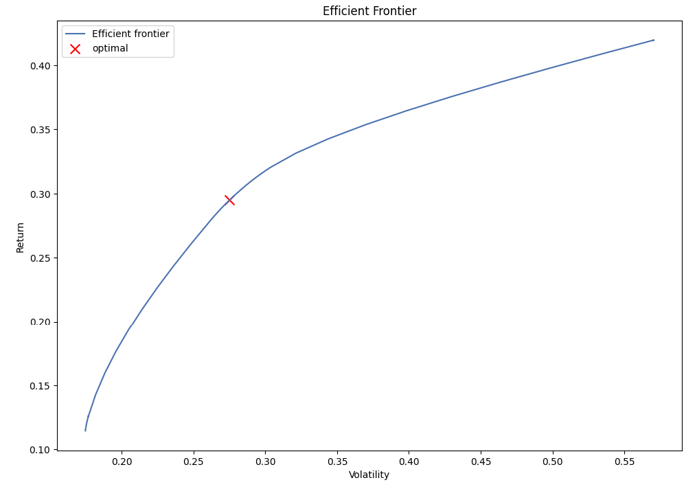
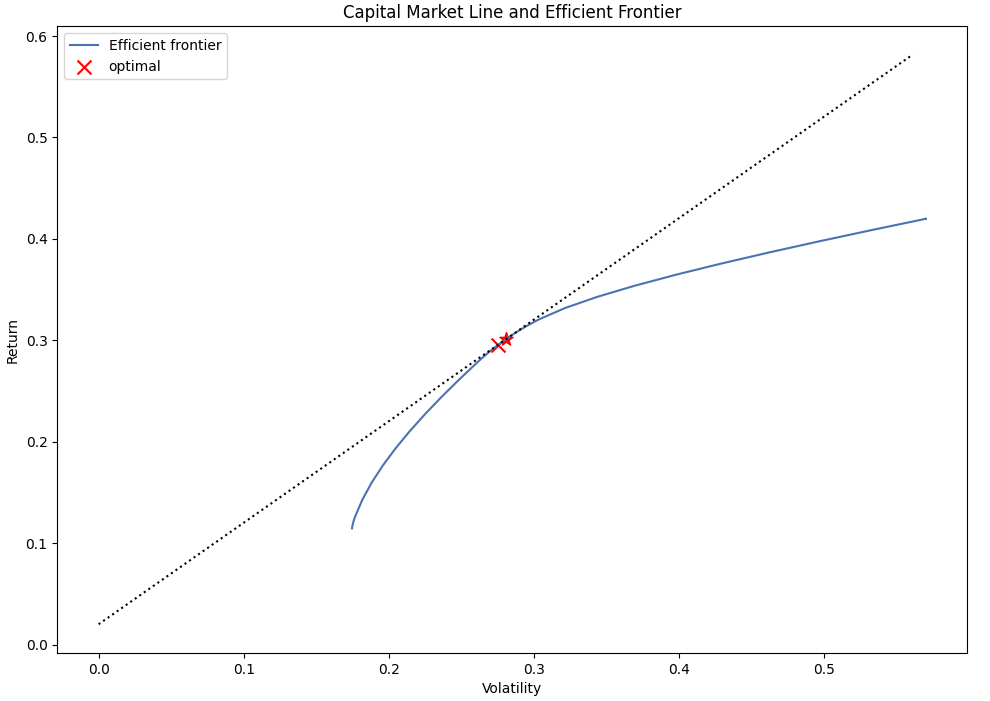

# Portfolio Optimization Model by Sz-Je Wang

## Purpose of the Code

This script optimizes a stock portfolio using the Efficient Frontier and Capital Market Line (CML) concepts from Modern Portfolio Theory. The objective is to maximize the Sharpe ratio, which is the ratio of the portfolio's expected return to its standard deviation (volatility). The script outputs the optimal weights for the selected stocks in the portfolio.

## The Portfolio Optimization Model

Modern Portfolio Theory is a mathematical framework for assembling a portfolio of assets such that the expected return is maximized for a given level of risk. It emphasizes the benefit of diversification. The Efficient Frontier is a set of optimal portfolios that offer the highest expected return for a defined level of risk. The Capital Market Line represents the tangent line from the risk-free rate to the efficient frontier in the risk-return plane.

## How the Script Works

1. The script fetches historical price data for the selected stocks using the Yahoo Finance API.
2. It then calculates the expected returns and sample covariance of the stock prices.
3. The EfficientFrontier function from the PyPortfolioOpt library is used to optimize the portfolio for the maximal Sharpe ratio.
4. It generates a Critical Line Algorithm (CLA) object and plots the Efficient Frontier.
5. Next, it defines the risk-free rate and plots the Capital Market Line.
6. Finally, the script calculates and prints the optimal investment strategy, i.e., the optimal weights for the selected stocks in the portfolio.

## Packages Used

```python
import numpy as np
import pandas as pd
import yfinance as yf
from pypfopt.efficient_frontier import EfficientFrontier
from pypfopt import risk_models, expected_returns
from pypfopt.cla import CLA
from pypfopt import plotting
import matplotlib.pyplot as plt
```

## Example Result

In this example, we use the following stocks in our portfolio: "AAPL", "AMZN", "BAC", "COP", "GOOGL", "PYPL", "SPY", "TSLA", "TSM", "XOM". We set the risk-free rate to 0.02 or 2%. After running our portfolio optimization, we obtain an estimate of the optimal weights for the selected stocks and plot the Efficient Frontier and Capital Market Line.

Please note that this result is based on historical stock prices over the past 10 years and does not guarantee future performance. The actual future returns and the optimal portfolio could be different based on various factors not included in this model.
```
Optimal Investment Strategy:
AAPL: 68.33%
AMZN: 10.47%
BAC: 0.00%
COP: 0.00%
GOOGL: 0.00%
PYPL: 0.00%
SPY: 0.00%
TSLA: 18.04%
TSM: 3.15%
XOM: 0.00%
```



